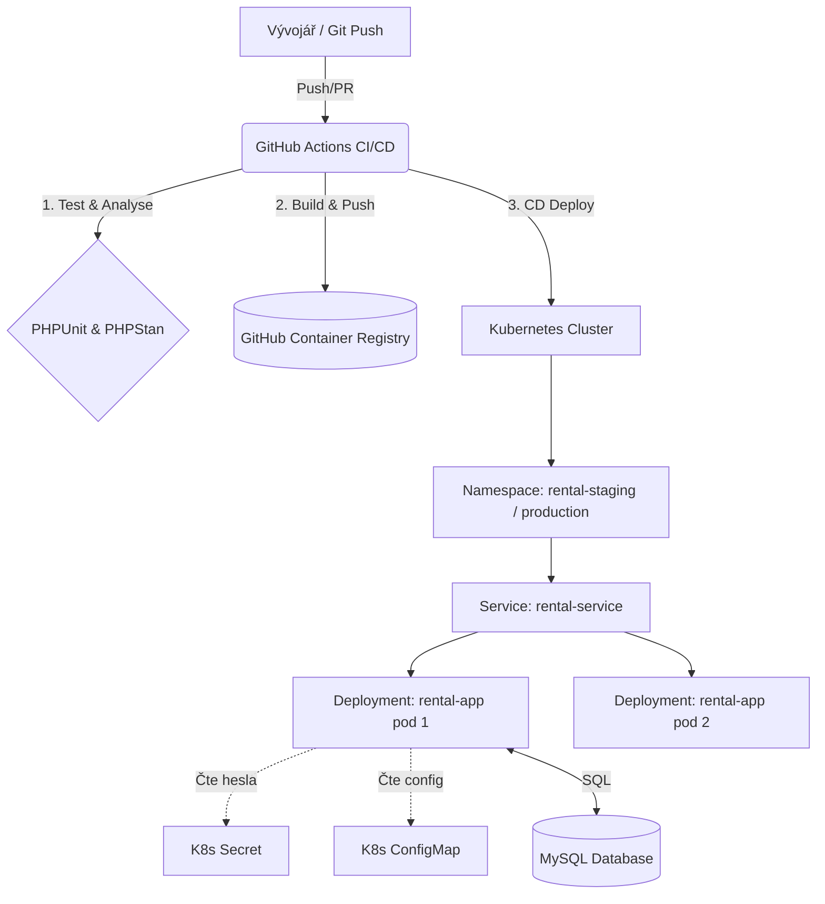

# Půjčovna sportovního vybavení (TDD Projekt)

Tento projekt byl vyvinut striktně pomocí metodiky **Test-Driven Development (TDD)**. Slouží k demonstraci doménového návrhu, práce s verzovacím systémem Git, automatizovaného testování a CI/CD integrace.

## 1. Stručný popis domény a funkcí
Aplikace řeší doménu **Půjčovny sportovního vybavení**. Skládá se ze 3 hlavních doménových entit a uplatňuje 5 klíčových business pravidel.

**Entity a vztahy:**
* `User` (Zákazník) - 1:N s rezervacemi.
* `Equipment` (Vybavení) - M:N s rezervacemi.
* `Reservation` (Rezervace) - propojuje zákazníka a vybavení.

**Aplikovaná business pravidla:**
1. Cena za den půjčení vybavení nesmí být záporná.
2. Zákazník s neuhrazenou pokutou nesmí vytvořit novou rezervaci.
3. Jedna rezervace může obsahovat maximálně 5 kusů vybavení (kapacitní omezení).
4. Při rezervaci delší než 7 dní se na celkovou částku aplikuje sleva 10 %.
5. Validace stavového přechodu: Rezervaci nelze přepnout do stavu "Vráceno" (`RETURNED`), pokud nebyla předtím ve stavu "Vyzvednuto" (`PICKED_UP`).

## 2. Jak projekt spustit lokálně
Projekt běží kompletně v Dockeru, takže k jeho spuštění není potřeba mít nainstalované lokální PHP ani databázi.

**Požadavky:** Docker a Docker Compose.

**Kroky spuštění:**
1. Naklonování repozitáře a přechod do složky projektu.
2. Spuštění kontejnerů:
   `docker compose up -d --build`
3. Instalace závislostí pomocí Composeru (uvnitř kontejneru):
   `docker compose exec app composer install`
4. Spuštění testů a vygenerování Code Coverage reportu:
   `docker compose exec app vendor/bin/phpunit`

Vygenerovaný HTML report pokrytí kódu testy (Code Coverage) se uloží do složky `/coverage`. Aktuálně kód přesahuje hranici >70 %.

## 3. Popis architektury
Aplikace je navržena s využitím principů Domain-Driven Design (DDD).
* **Doménová vrstva:** Obsahuje entity (`User`, `Equipment`, `Reservation`) a hodnotové objekty/výčty (`ReservationStatus`). Obsahuje veškerou business logiku a je zcela nezávislá na frameworku a databázi. Využívá moderní prvky PHP 8 (Readonly properties, Enums, Constructor property promotion).
* **Infrastrukturní vrstva (Perzistence):** Zastoupena třídou `UserRepository`, která implementuje návrhový vzor Repository. Stará se o mapování doménových objektů do relační databáze MySQL pomocí knihovny PDO (Prepared statements pro ochranu proti SQL injection). 
* **Vrstva rozhraní (API):** Zastoupena třídou `UserController`, která simuluje chování REST API. Zajišťuje validaci vstupních dat (např. kontrola formátu e-mailu, přítomnost povinných polí) a vrací odpovídající HTTP kódy (201 pro úspěch, 400 pro klientské chyby) spolu se srozumitelnými chybovými zprávami ve formátu JSON.

## 4. Testovací strategie
Celý vývoj probíhal v cyklech **Red-Green-Refactor** a struktura testů dodržuje konvenci **AAA** (Arrange, Act, Assert).

* **Jednotkové testy (Unit):** Umístěny ve složce `tests/Unit`. Pokrývají business pravidla, hraniční stavy a doménovou logiku naprosto izolovaně od vnějšího světa (bez databáze).
* **Integrační testy (Integration):** Umístěny ve složce `tests/Integration`. Testují napojení repozitáře (`UserRepository`) na reálnou databázi v Dockeru. Testovací prostředí si vždy dynamicky sestaví databázové schéma a po sobě ho může uklidit.
* **Mocking a Test Doubles:** Doloženo v souboru `ReservationTest.php`. Pro testování metody `calculateTotalPrice()` ve třídě `Reservation` byly použity testovací stubs (falešné objekty) pro třídu `Equipment`. Tím je zaručeno, že testujeme čistě jen logiku výpočtu ceny uvnitř rezervace a test nepadne v případě chyby uvnitř entity Vybavení.

## 5. CI/CD Pipeline
Projekt využívá GitHub Actions. Při každém push/pull requestu na `main` větev se automaticky:
1. Sestaví Docker prostředí (včetně MySQL).
2. Nainstalují závislosti.
3. Spustí celá testovací sada (Unit + Integration).
4. Vygeneruje Code Coverage report jako artefakt ke stažení.

## 6. API Dokumentace (Ukázka REST Endpointů)

Aplikace obsahuje ukázkovou implementaci rozhraní. Vrstva validuje vstupy a bezpečně zachytává doménové výjimky (`DomainException`).

### `POST /users`
Vytvoří nového zákazníka v systému.

**Příklad požadavku (Request):**
```json
{
  "id": 1,
  "name": "Jan Novák",
  "email": "jan.novak@example.com"
}
```

**Úspěšná odpověď (HTTP 201 Created):**
```json
{
  "message": "User created successfully",
  "id": 1
}
```

**Chybová odpověď - Špatný formát (HTTP 400 Bad Request):**
```json
{
  "error": "Validation error: invalid email format"
}
```

### `POST /reservations`
Zpracuje požadavek na vytvoření rezervace a ověří business pravidla (např. zda nemá uživatel neuhrazené pokuty).

**Příklad chybové odpovědi (HTTP 400 Bad Request - Porušení pravidla):**
```json
{
  "error": "User with unpaid fines cannot make a reservation."
}
```

## 7. Jak otestovat API naživo (Manuální testování)

Součástí projektu je i jednoduchý router (`public/index.php`), díky kterému lze REST API reálně vyzkoušet bez nutnosti složité konfigurace webového serveru (Apache/Nginx). K testování využijeme vestavěný vývojářský server přímo v PHP a nástroj cURL.

**1. Spuštění serveru:**
Otevřete si nové okno terminálu a spusťte PHP server uvnitř běžícího Docker kontejneru. Server bude naslouchat na portu 8000:
```bash
docker compose exec app php -S 0.0.0.0:8000 -t public
```
*(Tento terminál nechte běžet na pozadí.)*

**2. Odeslání HTTP požadavku:**
Abychom předešli problémům s escapováním uvozovek v příkazové řádce Windows, doporučujeme odeslat požadavek přímo z linuxového prostředí kontejneru. 

V původním okně terminálu se přepněte do kontejneru:
```bash
docker compose exec app sh
```

Následně odešlete testovací POST požadavek (vytvoření nového uživatele):
```bash
curl -i -X POST http://localhost:8000/users \
     -H "Content-Type: application/json" \
     -d '{"id": 50, "name": "Karel Testovaci", "email": "karel@test.cz"}'
```

**Očekávaný výsledek:**
API odpoví reálnou hlavičkou `HTTP/1.1 201 Created` a odpovídajícími JSON daty. Pro návrat do Windows terminálu stačí zadat příkaz `exit`.

## 8. DevOps & Infrastruktura (Rozšíření)

Projekt byl rozšířen o plnohodnotné DevOps workflow, které zajišťuje automatizované testování, kontejnerizaci a nasazení aplikace (CI/CD) do prostředí Kubernetes s důrazem na bezpečnost a operovatelnost.

### 8.1 Architektura a datové toky
Aplikace je navržena pro běh v kontejnerizovaném prostředí (Docker / K8s). Konfigurace je striktně oddělena od kódu pomocí proměnných prostředí (12-Factor App).



### 8.2 Kontejnerizace a Bezpečnost (K8s & Docker)
* **Multi-stage Dockerfile:** Kontejnerizace je rozdělena do fází (`base`, `dev`, `builder`, `prod`). Produkční obraz je minimalizovaný (neobsahuje dev závislosti jako PHPUnit/Xdebug), běží pod **bezpečným ne-root uživatelem** (`appuser`) a obsahuje definovaný `HEALTHCHECK` pro K8s sondy.
* **Správa tajných údajů (Secrets):** V repozitáři se **nenachází žádná hesla v plaintextu**. Lokální vývoj využívá standardní docker-compose proměnné. Pro K8s je připravena šablona `k8s/secret.example.yaml`. V reálném prostředí jsou hesla injektována bezpečně přes CI/CD pipeline přímo z GitHub Secrets do Kubernetes Secretu.
* **Kubernetes Manifesty:** Aplikace je definována pomocí standardních YAML manifestů (`Deployment`, `Service`, `ConfigMap`). Na úrovni K8s jsou definovány striktní resource limity (CPU/Memory requests a limits), aby se zabránilo přesycení clusteru.

### 8.3 CI/CD Pipeline a Správa prostředí
Pipeline je implementována pomocí GitHub Actions (`.github/workflows`) a skládá se ze 3 fází:
1. **CI (Test-and-Analyze):** Nasimuluje DB s čekáním na inicializaci (prevence race-conditions), spustí statickou analýzu (PHPStan) a Unit/Integration testy.
2. **Build-and-Push:** Po úspěšných testech sestaví čistý produkční Docker Image a pushne ho do GitHub Container Registry (GHCR) s unikátním tagem podle Git SHA.
3. **CD (Deploy):** Dynamicky vyhodnocuje cílové prostředí na základě Git Flow.
   * Větev `feature/*` -> nasazení do izolovaného namespace `rental-staging` (ověření).
   * Větev `main` -> nasazení do namespace `rental-production`.

### 8.4 Strategie nasazení (Release Management)
Výchozí strategií nasazení v našem Kubernetes Deploymentu je **Rolling Update**. Při nové verzi se postupně odstavují staré Pody a startují nové, čímž je zajištěn "Zero-Downtime Deployment" (aplikace je pro uživatele neustále dostupná). V případě chyby (healthcheck nového podu selže) se proces zastaví a je možné provést okamžitý rollback příkazem `kubectl rollout undo deployment/rental-app`.

### 8.5 Observabilita (Monitoring a Logy)
* **Logování:** Aplikace produkuje aplikační logy na standardní výstup (`stdout/stderr`), což plně koresponduje s K8s standardy. V produkci jsou tyto logy sbírány nástrojem Promtail a centralizovány v **Loki** pro snadné full-textové vyhledávání.
* **Monitoring a Alerting:** Metriky kontejneru a K8s nodů jsou sbírány nástrojem **Prometheus** a vizualizovány v **Grafaně**. 
* **Alerting:** Definovaná pravidla (Alertmanager) upozorní tým na Slack/E-mail při těchto událostech:
  * *CrashLoopBackOff:* Aplikace v K8s neustále padá.
  * *High Error Rate:* Počet HTTP 500 chyb stoupne nad 5 % za posledních 5 minut.
  * *Memory Saturation:* Pod dosahuje limitu paměti (riziko OOMKilled).